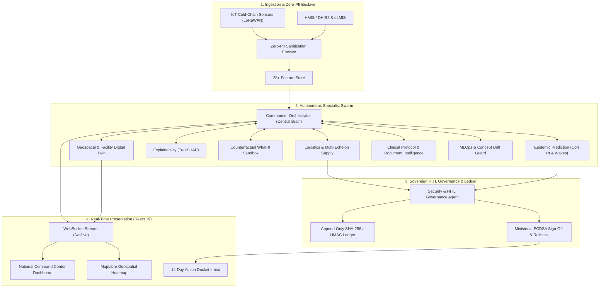

# VitaGrid GOV - Sovereign National Health Intelligence & Autonomous Logistics Command Platform

Production-grade real-time multi-agent architecture operating across **47 health zones** and **2,840 primary health centers (PHCs)**.

---

## 🏛 Multi-Agent Architecture Overview



---

## 🚀 Quickstart: Running the Python Backend

### 1. Requirements
- Python 3.11+
- (Optional) Redis server for distributed multi-worker bus (resilient in-memory fallback included)

### 2. Installation
```bash
# In repository root
pip install -r vitagrid_gov/requirements.txt
```

### 3. Start the Server
```bash
# Launch Uvicorn ASGI server on port 8000
PYTHONPATH=. uvicorn vitagrid_gov.main:app --host 0.0.0.0 --port 8000 --reload
```

Interactive OpenAPI Swagger UI is available at:
👉 `http://localhost:8000/docs`

---

## 📡 Connecting the React Frontend

### 1. WebSockets Stream
Connect to `ws://localhost:8000/ws/live` or channel-specific endpoints like `ws://localhost:8000/ws/kpis`.

```typescript
const socket = new WebSocket("ws://localhost:8000/ws/live");

socket.onmessage = (event) => {
  const message = JSON.parse(event.data);
  if (message.type === "KPI_PULSE") {
    console.log("Updated National KPIs:", message.data);
  }
};
```

### 2. REST Endpoints Summary
| Endpoint | Method | Description |
|---|---|---|
| `/command-center/kpis` | `GET` | 4 National Command Center KPI cards |
| `/command-center/defcon` | `POST` | Update DEFCON level (1 to 5) |
| `/predictions/epidemic/{county}` | `GET` | Bayesian Cori Rt & 14/30/60/90-day trajectories |
| `/predictions/explain/{facility}` | `GET` | TreeSHAP attribution & plain-language "Why At Risk?" |
| `/predictions/what-if` | `POST` | Counterfactual simulation (stock & staffing) |
| `/approvals/dockets` | `GET` | List pending dockets awaiting ministerial sign-off |
| `/approvals/authorize` | `POST` | Apply ministerial cryptographic signature & rollback token |
| `/digital-twin/corridor-heatmap`| `GET` | GeoJSON FeatureCollection for MapLibre / Leaflet |
| `/health` | `GET` | Liveness probe & audit ledger chain integrity |
| `/system/status` | `GET` | Health statuses of all 10 specialist agents |
